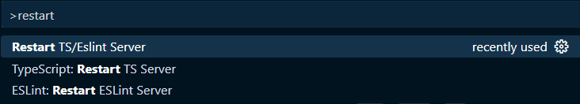
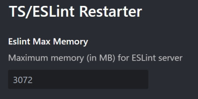

# TS/ESLint Restarter

The TypeScript Language Server and ESlint server becomes slow over long period of usage and sometimes gets stuck when changing files outside of VS Code (eg. changing git branches).

This extension simplifies the process with a single button in the Status Bar. Clicking the button reveals options to restart the TypeScript server, ESLint server, or both. Additionally, a Restart TS/ESLint Server command is available in the command palette (Ctrl + Shift + P).

Additionally, the extension provides an automatic restart feature for ESLint when memory usage reaches a certain threshold.

Inspired by the [Restart TS and ESLint server](https://github.com/acoreyj/vscode-restart-ts-eslint) extension, which does not have the automatic restart feature.

Inspired by the [Restart Your TS Server](https://github.com/HearTao/restart-your-ts-server) extension, which does the same for touch bars.

Inspired by the [Restart TS server Status Bar button](https://github.com/qcz/vscode-restart-ts-server-button) extension

## License

MIT
