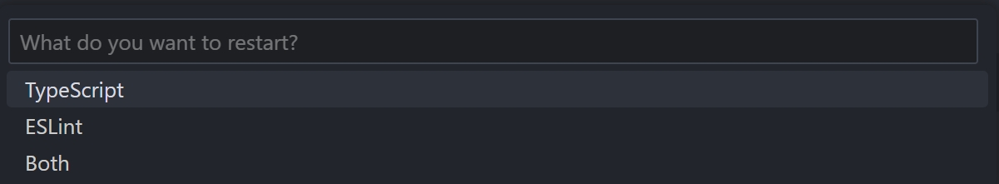

# Restart TS and ESLint server 

The TypeScript Language Server and ESlint server becomes slow over long period of usage and sometimes gets stuck when changing files outside of VS Code (eg. changing git branches). 

This extension adds a convenient _Restart TS_, _Restart ESLint_ and _Restart Both_ button to the Status Bar which allows you to quickly restart them.

This extension also adds a _Restart TS/ESLint Server_ command to the command palette (Ctrl + Shift + p)

Inspired by the [Restart Your TS Server](https://github.com/HearTao/restart-your-ts-server) extension, which does the same for touch bars.
Inspired by the [Restart TS server Status Bar button](https://github.com/qcz/vscode-restart-ts-server-button) extension

## License

MIT

